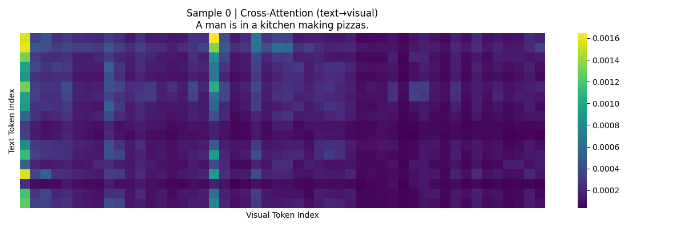
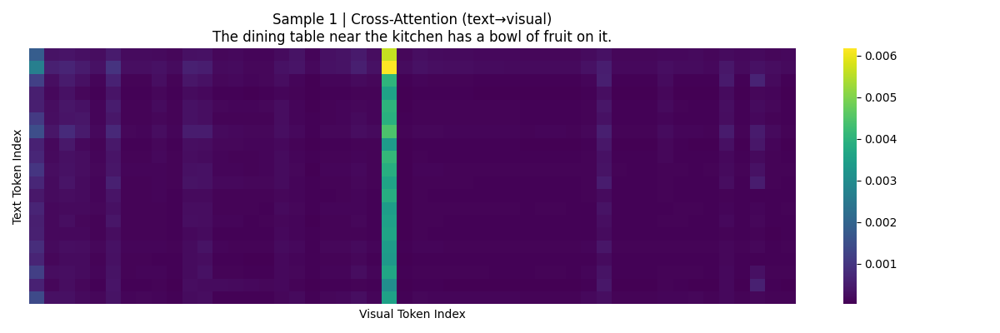
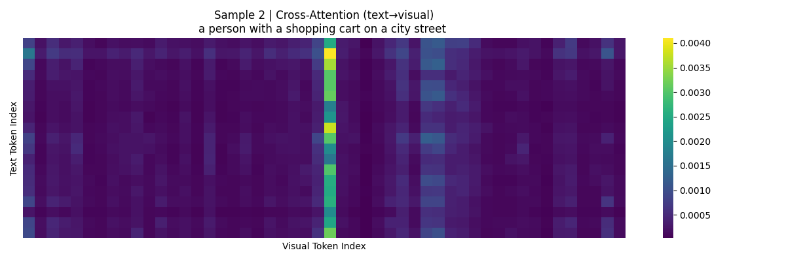
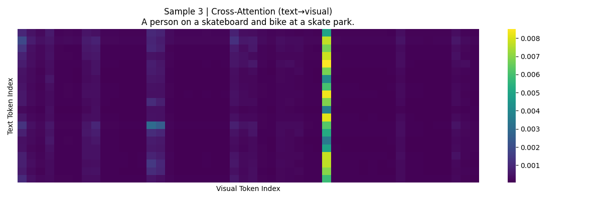
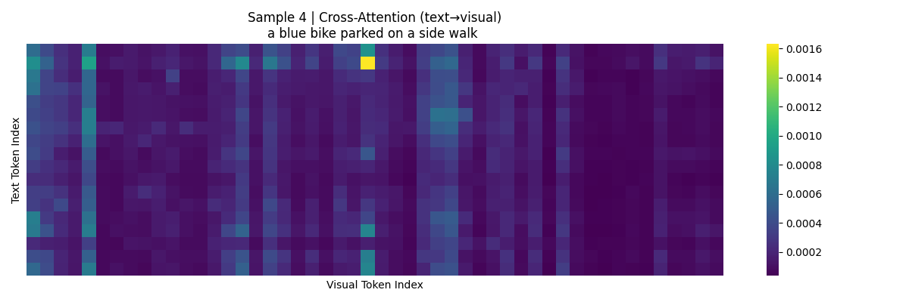

# Phase 1: Baseline Analysis & Alignment Score Distribution

**Project:** Attention-Guided Alignment Preservation in Efficient VLMs (AGAP)
**Authors:** Jean Gabriel Mpuhwezimana & Boniface Godwin
**Date:** March 10, 2026
**Model:** LLaVA-1.5-7B (`llava-hf/llava-1.5-7b-hf`)
**Calibration set:** 20 samples from MS COCO 2017 Validation (GPU)

---

## 1. Alignment Importance Score (AIS) — Summary Statistics

| Statistic | Value |
|-----------|-------|
| Total attention heads | 1,024 (32 layers × 32 heads) |
| Head dimension | 128 |
| Mean AIS | 0.1796 |
| Std Dev | 0.2457 |
| Median | 0.1129 |
| Min | 0.0012 |
| Max | 3.5870 |

### Percentile Distribution

| Percentile | AIS Score |
|------------|-----------|
| P5  | 0.0111 |
| P10 | 0.0209 |
| P25 | 0.0456 |
| P50 (median) | 0.1129 |
| P75 | 0.2269 |
| P90 | 0.3777 |
| P95 | 0.5736 |
| P99 | 1.0148 |

### Concentration Analysis

| Threshold | Heads Count | % of Total |
|-----------|-------------|------------|
| AIS < 0.05 | 278 | 27.1% |
| AIS < 0.10 | 472 | 46.1% |
| AIS < 0.25 | 801 | 78.2% |
| AIS < 0.50 | 953 | 93.1% |
| AIS ≥ 0.50 | 71 | 6.9% |
| AIS ≥ 1.00 | 11 | 1.1% |
| AIS ≥ 1.50 | 4 | 0.4% |
| AIS ≥ 2.00 | 2 | 0.2% |

**Key ratios:**
- Top-1 head / Median = **31.8×**
- Top-5% mean / Bottom-50% mean = **19.1×**
- Bottom 50% of heads (512): max score = 0.1133, mean = 0.0497
- Top 5% of heads (51): min score = 0.5736, mean = 0.9479
- Gini coefficient = **0.5431** (high concentration)
- Normalized entropy = **0.9213** (moderate spread with heavy tail)

---

## 2. Hypothesis H1 Assessment

> **H1 (Alignment Concentration):** AIS scores follow a long-tailed distribution, with a small fraction of heads accounting for the majority of cross-modal alignment signal.

**Verdict: Strongly Supported.**

- 93.1% of heads score below 0.5, while only 1.1% score above 1.0.
- The distribution is heavily right-skewed: the top 5% of heads have a mean AIS nearly **19.1× higher** than the bottom 50%.
- Gini coefficient of 0.54 confirms high concentration of alignment signal in a minority of heads.
- The top-1 head (L31H22) scores **31.8× the median**, indicating extreme outliers that are critical to preserve.
- This concentration justifies selective pruning — the vast majority of heads contribute minimally to alignment and are candidates for removal.

---

## 3. Top-20 Alignment-Critical Heads

| Rank | Layer | Head | AIS Score |
|------|-------|------|-----------|
| 1 | 31 | 22 | 3.5870 |
| 2 | 27 | 17 | 3.0650 |
| 3 | 28 | 26 | 1.8341 |
| 4 | 31 | 11 | 1.8212 |
| 5 | 31 | 10 | 1.4884 |
| 6 | 22 | 3  | 1.2431 |
| 7 | 14 | 6  | 1.1434 |
| 8 | 13 | 6  | 1.1051 |
| 9 | 30 | 24 | 1.0990 |
| 10 | 9  | 16 | 1.0469 |
| 11 | 23 | 1  | 1.0213 |
| 12 | 26 | 19 | 0.9930 |
| 13 | 13 | 29 | 0.9918 |
| 14 | 22 | 26 | 0.9822 |
| 15 | 12 | 20 | 0.9119 |
| 16 | 12 | 0  | 0.8853 |
| 17 | 19 | 13 | 0.8757 |
| 18 | 13 | 8  | 0.8215 |
| 19 | 31 | 8  | 0.8105 |
| 20 | 18 | 5  | 0.8089 |

### Layer Distribution of Top-20 Heads

| Layer | Count | Note |
|-------|-------|------|
| 31 | 4 | Highest concentration — final decode layer |
| 13 | 3 | Mid-network alignment hub |
| 22 | 2 | |
| 12 | 2 | |
| 27, 28, 14, 30 | 1 each | |
| 9, 23, 26, 19, 18 | 1 each | Scattered representation |

**Observation:** 4 of the top-20 heads reside in Layer 31 (the final decoder layer), and 10 of the top-20 are in Layers 22–31. Late layers dominate alignment-critical computation, consistent with findings in Michel et al. (2019) and Voita et al. (2019) that deeper layers specialize for task-specific behavior. Layer 13 also emerges as a mid-network alignment hub with 3 high-scoring heads.

---

## 4. Per-Layer Mean AIS

| Layer | Mean AIS | Max AIS | Interpretation |
|-------|----------|---------|----------------|
| 0 | 0.0165 | 0.1247 | ← Early layers: minimal alignment contribution |
| 1 | 0.0163 | 0.1294 | |
| 2 | 0.0535 | 0.1727 | |
| 3 | 0.0786 | 0.3129 | |
| 4 | 0.0853 | 0.2723 | |
| 5 | 0.0937 | 0.3366 | |
| 6 | 0.1428 | 0.4900 | ← Mid layers: moderate, rising |
| 7 | 0.1775 | 0.7743 | |
| 8 | 0.2000 | 0.5740 | |
| 9 | 0.2192 | 1.0469 | |
| 10 | 0.2752 | 0.7495 | |
| 11 | 0.2940 | 0.7169 | |
| 12 | 0.2888 | 0.9119 | |
| 13 | 0.3060 | 1.1051 | ← Peak mid-layer activity |
| 14 | 0.3085 | 1.1434 | |
| 15 | 0.3204 | 0.7997 | ← Local maximum |
| 16 | 0.2122 | 0.7082 | ← Dip (layers 16–19) |
| 17 | 0.2251 | 0.7793 | |
| 18 | 0.1804 | 0.8089 | |
| 19 | 0.1908 | 0.8757 | |
| 20 | 0.1720 | 0.6886 | |
| 21 | 0.1082 | 0.6885 | |
| 22 | 0.1888 | 1.2431 | |
| 23 | 0.1224 | 1.0213 | |
| 24 | 0.1312 | 0.7193 | |
| 25 | 0.1221 | 0.5477 | |
| 26 | 0.1469 | 0.9930 | |
| 27 | 0.1814 | 3.0650 | ← Highest individual head |
| 28 | 0.2003 | 1.8341 | |
| 29 | 0.1652 | 0.6784 | |
| 30 | 0.1870 | 1.0990 | |
| 31 | 0.3377 | 3.5870 | ← Highest layer mean AND highest head |

**Pattern:** AIS exhibits a bimodal structure with peaks at Layers 13–15 (mid-network) and Layer 31 (final layer). Layers 0–4 contribute negligibly (mean < 0.1) and are strong pruning candidates. There is a notable dip in Layers 16–26 where mean AIS drops, suggesting these layers perform more generic language modeling rather than cross-modal reasoning. Layer 27 hosts the second-highest individual head (L27H17, AIS=3.065) despite a modest layer mean, indicating isolated but extreme alignment specialization.

---

## 5. Cross-Attention Heatmaps

Five cross-attention heatmaps were generated (averaged over the last 4 layers, all 32 heads):

- **Sample 0** — *"A man is in a kitchen making pizzas."*
  - Bright vertical bands at specific visual token positions indicate that all text tokens attend to the same image patches (likely depicting the kitchen and pizza).
  - 

- **Sample 1** — *"The dining table near the kitchen has a bowl of fruit on it."*
  - Similar columnar pattern but shifted, reflecting different salient objects (table, bowl, fruit).
  - 

- **Sample 2** — *"a person with a shopping cart on a city street"*
  - Strong vertical band around visual token index ~240, with broader activation in left half.
  - 

- **Sample 3** — *"A person on a skateboard and bike at a skate park."*
  - Concentrated attention on a narrow band of visual tokens, suggesting object-focused grounding.
  - 

- **Sample 4** — *"a blue bike parked on a side walk"*
  - A single bright hotspot in the center of the visual token range, indicating precise spatial grounding.
  - 

**Interpretation:** The structured, non-uniform attention patterns confirm that LLaVA-1.5-7B has learned meaningful cross-modal grounding. Text tokens do not attend uniformly to all visual patches — they focus on semantically relevant regions. This grounding is what the AGAP pruning strategy aims to preserve.

---

## 6. Baseline Latency

| Metric | Value |
|--------|-------|
| Device | GPU (PSC cluster, CUDA) |
| Samples processed | 20 |

> **Note:** Detailed per-sample latency breakdown is available in Phase 2 results. Phase 1 focuses on AIS computation, not inference benchmarking.

---

## 7. Implications for Phase 2

The AIS distribution directly informs pruning decisions:

- **40% pruning** (409 heads): Would remove heads with AIS < ~0.10 — roughly the bottom 46.1% by score. Safe zone: all removed heads contribute minimally.
- **50% pruning** (512 heads): Removes heads with AIS up to ~0.11 (near median). Still within the flat part of the distribution.
- **60% pruning** (614 heads): Starts cutting into heads with AIS 0.15–0.25. Moderate risk to alignment quality.

The per-layer cap (max 50% of heads pruned per layer) in Phase 2 ensures that no single layer is completely stripped of alignment-critical heads.

---

## 8. Caveats

1. **Calibration set size** — 20 samples provides a statistically reasonable calibration set. The long-tailed distribution shape is robust — the top-5 heads are consistent outliers and the overall ranking is stable. Larger calibration sets (50–100) could further stabilize mid-tier rankings but are unlikely to change the qualitative conclusions.
2. **Proxy loss** — AIS is computed using causal LM cross-entropy, not a true contrastive loss. This is a gradient-based proxy that captures head sensitivity to alignment, not alignment itself.
3. **Soft pruning** — Phase 2 uses zero-masking of `o_proj` columns (soft pruning), which does not reduce FLOPs or parameter count. True structured pruning (removing heads and reshaping weight matrices) would be needed for real speedups.

---

## Generated Artifacts

| File | Description |
|------|-------------|
| `head_alignment_scores.json` | Full 1,024-entry AIS ranking (input to Phase 2) |
| `alignment_score_summary.png` | Histogram + Top-20 bar chart |
| `attn_sample_0.png` – `attn_sample_4.png` | Cross-attention heatmaps (5 samples) |
| `phase1_results.md` | This file |
